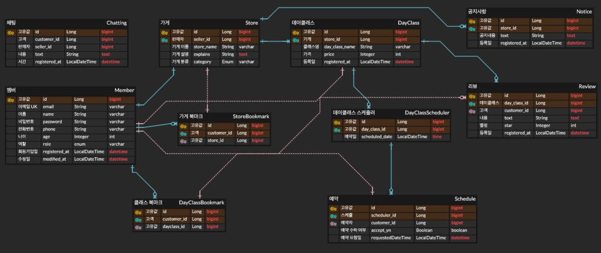

# OneTwoClass
해당 서비스는 커피나 베이커리, 디저트 등 원데이 클래스나 취미반 클래스를 취급하여 예약 서비스를 제공합니다.

## 개발 기간

6/12(월) ~ 7/17(월) 총 5주 동안 진행

## 기술 스택

- Java
- SpringBoot
- JPA
- 도커
- MySQL
- GitHub
- H2 - test용

## 기능

### 공통
- [x] 회원가입 기능 구현
- [x] 로그인 기능 구현
- [ ] 채팅
- [ ] 공지사항 조회
- [x] 로그인 시 토큰 발행

### 판매자
- [ ] 가게 등록, 수정, 삭제
- [ ] 클래스 등록, 수정, 삭제
- [ ] 클래스 예약 요청 수락
- [ ] 공지사항 작성

### 고객
- [ ] 클래스 예약 요청
- [ ] 스토어 즐겨찾기 등록
- [ ] 클래스 즐겨찾기 등록
- [ ] 리뷰 작성

### 가게 - 클래스
- [ ] 리뷰 평균 별점

## ERD

## Trouble Shooting
[Trouble Shooting Page][link]

[link]: https://github.com/Nokchamat/oneTwoClass/blob/main/TROUBLE_SHOOTING.md

